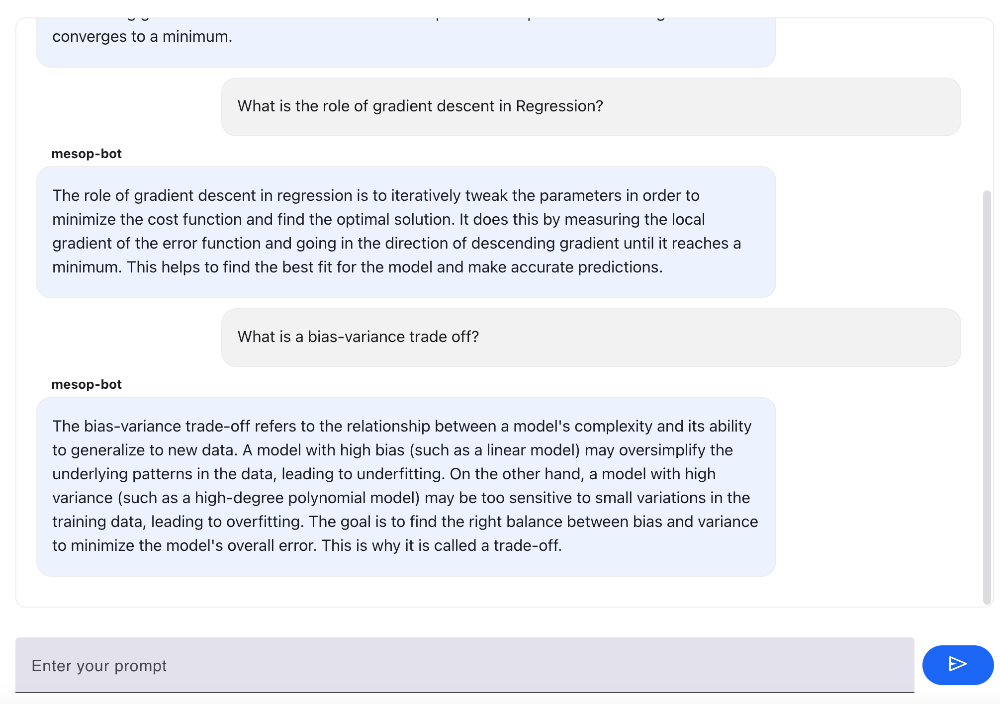

# QnA-bot
This project uses LangChain and OpenAI to create a sophisticated Q&amp;A system, handling PDFs files. It utilises OpenAI models for precise answer retrieval and generation, with advanced text processing and indexing for efficient data management.

# Advanced Q&A System

This repository contains the code for an advanced Question and Answer (Q&A) system that utilizes LangChain and OpenAI's language models to process and answer queries from various document formats including PDFs files. 
The system employs RAG techniques to improve the performance of LLM's advanced NLP techniques for effective information retrieval and understanding. RAG retrieves data from outside the language model (non-parametric) and augments the prompts by adding the relevant retrieved data in context. This allows the model to generate more accurate and relevant responses, even when the context is large. To get a easy smooth and interactive user interface incorporated google mesop for best UI experience.

## Features

- **Document Processing**: Handles multiple document formats, such as PDFs and text files, using `langchain_community` document loaders.
- **Natural Language Processing**: Leverages OpenAI’s language models `gpt-3.5` integrated via `langchain_openai` for enhanced natural language understanding.
- **Efficient Data Handling**: Incorporates text processing and indexing for efficient data management and retrieval.

## Getting Started

### Prerequisites

- Python 3.x
- Pip
- langchain
- openai
- mesop
- tiktoken
- pyPdf

### Run the app
 mesop file_name.py

## Output
